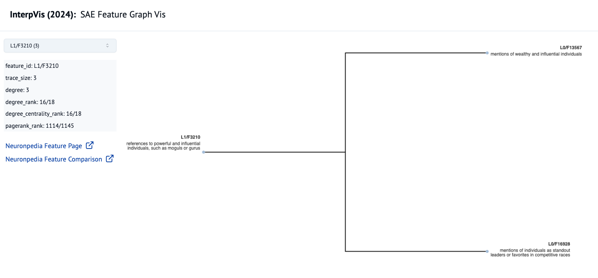

# SAE Feature Graph Vis

This is a visualisation tool for exploring correlations between features obtained from an SAE trained on the residual stream of a transformer model. The tool was originally developed during the [InterpVis](https://www.apartresearch.com/event/interpvis-apr-2024) Hackathon.

We obtained pairwise correlations between features across the layers and linked them to form a directed graph (as shown below).

The tool is currently in its infancy, will develop it further when time allows.

To do:

- [ ] Optimise the generation of correlations
- [ ] Add a script for importing data into Neo4J
